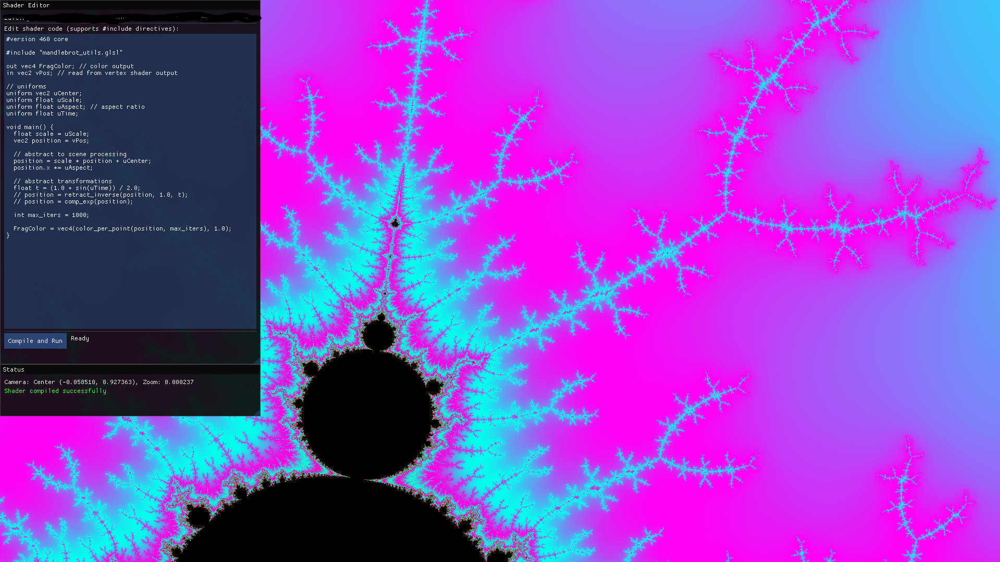

# Shader editor and visualiser

This repository currently centers on a small OpenGL shader editor: a desktop application that renders a fullscreen quad, drives a fragment shader with camera and time uniforms, and lets the user recompile the fragment shader live from an ImGui editor.

## Structure
The app consists of the following modules

- `main.cpp` is the runtime coordinator. It creates the GLFW window and OpenGL context, compiles the initial shaders, owns the render loop, updates uniforms, forwards input into the camera, and swaps in newly compiled fragment shaders coming from the GUI.
- `camera` is a headless 2D navigation module. It stores the world-space center and zoom state used to explore the rendered scene, and exposes movement, drag-pan, and zoom-at-point operations.
- `compiler` is the shader build pipeline wrapper. It preprocesses shader sources, asks OpenGL to compile them, and returns either a shader handle or an error string
- `preprocessor` is used by `compiler` and essentially expands `#include "..."` directives before OpenGL sees the source. This is what allows the fragment shader to be split across reusable GLSL files.
- `gui` is the GUI built with Dear ImGui. It displays the fragment shader source, writes edited content to a temporary file, invokes the compiler, and reports success or failure back to the main loop.

## Execution:

The main executable follows a straightforward startup sequence:

1. Initialize GLFW and GLAD, then create the OpenGL 3.3 core context.
2. Construct a `Compiler` configured with the `shaders/` directory as an include search path.
3. Compile the vertex shader and the initial fragment shader.
4. Link them into a shader program.
5. Create a single fullscreen quad in GPU memory.
6. Construct the `Camera` and `Gui`, then load the fragment shader source into the editor.
7. Enter the render loop.

Once the app is running, each frame has two simultaneous events happening:

- Render the scene by binding the current shader program, pushing uniforms such as `uCenter`, `uScale`, `uAspect`, and `uTime`, then drawing the fullscreen quad.
- Render the editor UI, which may produce a freshly compiled fragment shader if the user presses `Compile and Run`.

If the GUI produced a new fragment shader successfully, `main.cpp` links it with the existing vertex shader into a new program and replaces the previously active program.

## Rendering
A single quad (4 vertices) formed with two triangles is rendered to fill the entire viewport:
- the vertex shader defines the screen-filling surface,
- the fragment shader puts color to each pixel,
- the camera uniforms map screen coordinates into the shader's world space.

## Shader Compilation
The shader compilation happens in two stages. This structure is implemented because It started being a nightmare to write my entire shaders in a single file and to copy paste functions defined somewhere else. Initially, I called a CPP to preprocess `#include` directives but that did not feel well. 

1. Preprocessing
2. OpenGL compilation and linking

### 1. Preprocessing

`Preprocessor::process_source()` reads the requested shader file recursively and replaces each supported `#include "file.glsl"` directive with the contents of the target file.

The resolver searches:

- first in the directory of the file containing the include,
- then in the configured include directories, currently rooted at `shaders/`.

The preprocessor also keeps an expansion stack so recursive include cycles fail early with an explicit error instead of producing invalid source.

### 2. Compilation and Linking

`Compiler::compile()` takes the preprocessed source and passes it to OpenGL with the requested shader type. On success it returns a compiled shader object; on failure it returns the OpenGL log.

`main.cpp` links:

- the startup vertex shader with the startup fragment shader during initial boot,
- the existing vertex shader with a freshly compiled fragment shader after a live edit.

That separation is the core architectural idea of the editor: preprocessing and compilation are isolated in reusable code, while program replacement stays in the main runtime loop where OpenGL object lifetime is already managed.

## Input and Camera

The camera is the only persistent scene-state object that directly influences rendering. It defines:

- the current world-space center,
- the zoom factor,
- the effective scale used to convert navigation state into shader uniforms.

Input is handled in GLFW callbacks owned by `main.cpp`:

- keyboard input moves or zooms the camera when the GUI is not capturing the keyboard,
- mouse drag pans the camera when the pointer is outside active GUI interaction,
- mouse wheel zooms toward the current cursor position.

This split matters because it keeps `Camera` independent from both GLFW and ImGui. The callbacks translate window-space input into camera operations, and the render loop later translates camera state into shader uniforms.

## GUI
- load the editable fragment shader source from disk,
- present that source in a multiline text editor,
- save the edited text to a temporary shader file,
- ask the compiler to build that temporary file,
- expose compilation success or failure to the main loop,
- show camera state and compile errors in a status panel.
